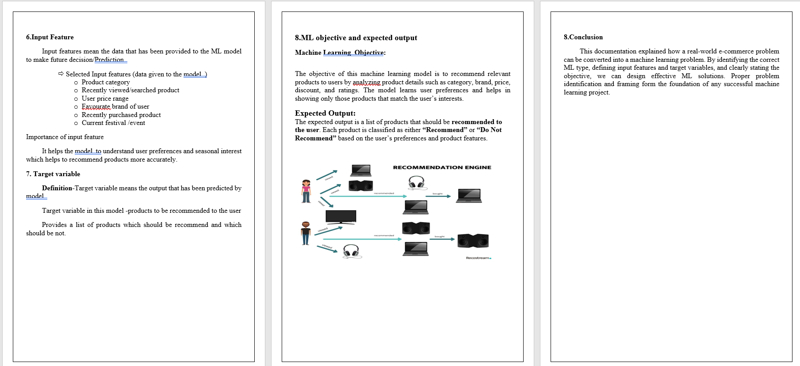

# VauTech IT Solutions – Task Submissions

This repository contains the tasks and assignments completed as part of my learning, training, and evaluation process with **VauTech IT Solutions**.
Each task focuses on practical problem-solving, concept clarity, and real-world application of technical skills.

---

## 👨‍💻 About Me

**Name:** Kaushal Raut
**Role:** Learner / Trainee
**Interests:** Frontend Development, Machine Learning, Web Technologies , Backend

---

## 📝 Tasks Overview

### ✅ Task 1: Machine Learning – Problem Identification & Framing

* Understanding how to convert real-world problems into ML problems
* Identifying ML type (Classification / Regression / Clustering)
* Defining input features and target variables
* Industry use case: **E-commerce Product Recommendation**

---
## 🎯 Objective

The main goal of this repository is to:

* Demonstrate problem-solving ability
* Apply theoretical knowledge practically
* Maintain clean, readable, and well-structured code
* Showcase continuous learning and improvement

---
## screenshots 
* screenshot 1

* screenshot 2

* screenshot 3

## ✅ Task 2: Dataset Sourcing and Understanding

- Sourcing a real-world dataset from Kaggle, UCI Machine Learning Repository, or other open ML repositories  
- Loading the dataset using Python  
- Understanding dataset structure (rows, columns, and data types)  
- Identifying input features and target variable  
- Categorizing features into numerical and categorical types  
- Analyzing dataset size and class distribution  
- Identifying dataset limitations such as missing values, imbalance, noise, and size constraints  

---

## 🎯 Objective

The main goal of this repository is to:

- Demonstrate problem-solving ability  
- Apply theoretical knowledge practically  
- Maintain clean, readable, and well-structured code  
- Showcase continuous learning and improvement  

---

## 📸 Screenshots

- Screenshot 1  
  

- Screenshot 2  
  

---

## 📌 Notes

* This repository will be **updated regularly** with new tasks.
* Each task is documented clearly for easy understanding.
* Code is written with a focus on **clarity and correctness**.

---

## 📬 Contact

If you have any queries or feedback regarding the tasks, feel free to reach out.

**GitHub:** [https://github.com/Kaushall-raut](https://github.com/Kaushall-raut)

---

⭐ *Thank you for reviewing my work!*
